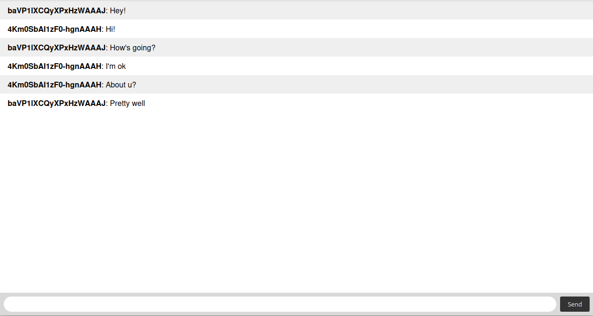

# express-socketio-typescript

Websocket messaging Server with a simple Chat developed with:
- NodeJS
- ExpressJS
- Socket.io
- Typescript

<a href="https://www.buymeacoffee.com/cicerokze" target="_blank">
	
</a>

## Description

This is a simple Websocket messaging server with a Chat. This App was developed with NodeJS, ExpressJS and Socket.io based on Typescript language.

## Installation
1. Clone this project
2. Enter the project's folder
3. Run the command `npm install` to install all dependencies

```bash
$ npm install
```

## Starting the Application

```bash
# development
$ npm run dev
```

## Testing with Chat

1. Open TWO tabs in your prefered browser and type http://localhost:8080 in both of them.
2. In the first tab, find the input bar in the bottom of the page, type some message and click on the button "Send".
3. In the second tab, do the same, but typing a diferent message and click on the button "Send".
4. You can test with different devices, but make sure your devices are in the same network (it could be your WiFi).
5. In the another device, with your prefered browser type the same address replacing the host 'localhost' with the IP address where server is running. Example: http://192.168.0.1:8080 (check It before).
6. Take the same test by typing your names or type whatever you want.

When you try this address, you will probably see a warning saying: Not a secure address. This happens because the server is local (http). Do not worry about that. Access to your Chat is only permitted to those who have access to the network.

## Example: [chat-app-example](https://cicerokze-82mb3.ondigitalocean.app/)



This example is public. It means everyone connected will see and send messages from/for everyone. 